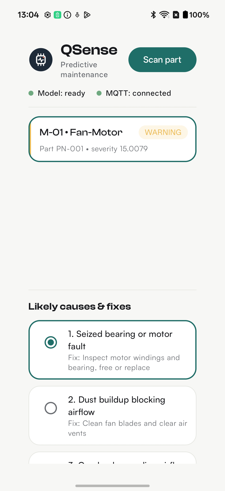

# QSense — Maintenance Assistant

**On-device predictive maintenance.** A fault alert arrives over MQTT, relevant failure modes are
retrieved from an on-device knowledge base, an on-device LLM turns them into ranked causes & fixes,
the operator picks one and resolves it — all on the phone, no cloud round-trip.

Kotlin Multiplatform + Compose (Android target) · Qualcomm GenieX on-device LLM · HiveMQ MQTT 5 ·
RAG grounding.

---

## QSense App — Maintenance Assistant

<p align="center">
  
  <br>
  <em>A live fault alert — the <strong>issue</strong> (M-01 · Fan-Motor, WARNING) with on-device AI-generated likely causes &amp; fixes (the <strong>solution</strong>).</em>
</p>

---

## What it does — the flow

### Diagnosis flow (v1)

```
Detect            Retrieve           Diagnose            Review              Resolve
MQTT alert   →    RAG lookup    →    GenieX LLM     →    Dashboard      →    Ack over MQTT
machine+part      known failure      ~5 ranked           operator picks      resolution + ack
temp/humidity     modes for part     causes + fixes      the real cause      published
```

1. **Detect** — a `FaultAlert` (machine no + part, optional temperature/humidity) arrives on
   `qsense/machine/monitoring`.
2. **Retrieve** — `InMemoryKnowledgeBase` looks up known failure modes for that part (deterministic
   keyword match — no embeddings).
3. **Diagnose** — the retrieved issues + sensor context are built into a grounded prompt; the
   on-device GenieX LLM ranks and rewrites them into ~5 causes + fixes, sourced from the
   known-issues dataset.
4. **Review** — the dashboard shows the causes/fixes; the operator selects the real one and adds
   notes.
5. **Resolve** — publishes a `Resolution` (+ a minimal ack) over MQTT; the alert is marked resolved
   only after both publishes are acknowledged.

Everything left of the broker runs **on the phone**.

---

## Architecture — clean-architecture KMP

The domain is pure Kotlin behind interfaces; platform SDKs are adapters. The domain never imports an
Android SDK, so use cases and ViewModels are unit-testable on the JVM with fakes, and each vendor SDK
can be swapped without touching logic.

| Layer | Responsibility |
|---|---|
| `shared/commonMain` _(pure Kotlin)_ | Domain models; service **interfaces** (`TextGenerator`, `MqttGateway`, `Clock`); use cases; RAG (`KnowledgeBase` + `InMemoryKnowledgeBase`); prompt builder + tolerant `JsonDiagnosisParser`; Compose UI + ViewModels + theme |
| `shared/androidMain` _(SDK adapters)_ | `GenieXTextGenerator` (GenieX), `HiveMqttGateway` (HiveMQ), `SystemClock`, CameraX capture + Compose `expect/actual` for camera & image |
| `androidApp` _(thin shell)_ | Builds the `AppContainer` once (manual DI), hosts the activity, loads fonts, launcher icon |
| `server/` _(Python)_ | v2 vision service: `paho-mqtt` + `Pillow` (→ RTMDet/ONNX); pure `handler()` unit-testable without a broker |

**DI:** no framework — `AppContainer` is a constructor-injected class built from platform services
and handed to ViewModels via `viewModel { … }`.

---

## Tech stack & SDKs — and why each

| Component | Version | Role & why we use it |
|---|---|---|
| **Kotlin Multiplatform** | — | Splits pure logic from platform code → JVM-testable, iOS-ready. Android is the only shipping target today. |
| **Compose Multiplatform** | — | Declarative UI beside the shared code; one design system everywhere. |
| **[Qualcomm GenieX](https://aihub.qualcomm.com/geniex)** ([SDK](https://github.com/qualcomm/geniex)) | 0.3.1 | **On-device LLM** via llama.cpp/GGUF (QAIRT/Genie). The only runtime that loads our GGUF model; runs on Snapdragon 8 Elite. |
| **HiveMQ MQTT client** | 1.3.15 | MQTT 5 transport, QoS 1. Async PUBACK futures, automatic reconnect, and a WebSocket transport fallback for networks that block/reset raw 1883. |
| **kotlinx-serialization** | 1.11.0 | JSON for MQTT + LLM payloads. Multiplatform, compile-time, no reflection. `strict` for MQTT, `lenient` for model output. |
| **kotlinx-coroutines** | — | Flows model the MQTT/LLM event streams; deterministic ViewModel tests via an injected test dispatcher. |
| **CameraX** | 1.4.1 | v2 vision capture. Lifecycle-aware; `imageProxy.toBitmap()` → downscale to 640px. |
| **paho-mqtt · Pillow** | 2.1 · 11.0 | PC vision service — reference Python MQTT client + lightweight image annotation. |

### On-device LLM + RAG (why it's shaped this way)

- The LLM is asked to **select-and-adapt** over retrieved failure modes, not invent freely — a small
  model handles that far more reliably.
- Output is constrained by an **ASCII-only GBNF grammar** (the crash guarantee: GenieX aborts on
  invalid UTF-8); JSON structure comes from the prompt + a tolerant parser, not the grammar.
- Causes/fixes are grounded in — and sourced from — the on-device **known-issues dataset**, so the
  operator always sees real, known failure modes for that part. A larger (1B-class) instruct model
  would let the LLM lead the ranking/rewrite. See
  `docs/reports/2026-07-12-on-device-llm-iteration.md`.

---

## Model profiling

Measured **on-device** (Snapdragon 8 Elite Gen 5 / `SM8850`) with the side-loaded
[`Qwen3-0.6B`](https://aihub.qualcomm.com/models/qwen3_0_6b) as a `Q4_0` GGUF (~409 MB, 4-bit). No external profiler — just `adb logcat -s QSenseGenieX`
(timestamps) and `adb shell dumpsys meminfo com.example.qsense`:

| Metric | Value | How it's read |
|---|---|---|
| Cold load: SDK init → `model READY` | **~13.8 s** | Δ between the `load: model dir` and `load: model READY` log lines |
| ├ `LlmWrapper` build (GGUF → runtime) | ~13.7 s | the dominant step; SDK init + plugin + manager ≈ 20 ms |
| App PSS with model resident | **~470 MB** | `dumpsys meminfo` → TOTAL PSS |
| App RSS | **~647 MB** | `dumpsys meminfo` → TOTAL RSS |
| Native heap (mmapped GGUF weights) | **~332 MB** | dominates memory; ≈ the 4-bit model size |

**Generation latency** is read per call from the `generate: start` → `generate: done` log delta; see
`docs/reports/2026-07-12-on-device-llm-iteration.md` for the model's output behaviour. Everything is
profiled on the phone — no laptop or cloud involved.

---

## Build & run

```bash
./gradlew :androidApp:assembleDebug     # build APK
./gradlew :androidApp:installDebug      # install on a connected device
./gradlew :shared:testAndroidHostTest   # unit + integration tests (JVM host, no phone)
```

### Configure it (no `.env` — config is Kotlin)

All runtime config lives in **`shared/src/androidMain/kotlin/com/example/qsense/di/AndroidConfig.kt`**
as data-class defaults, wired once in `androidApp/.../QSenseApplication.kt`. There is no `.env` file.

| Setting | Field in `AndroidConfig.kt` | Default |
|---|---|---|
| MQTT broker host | `MqttConfig.host` | `192.168.8.153` (a LAN broker) |
| Port / transport | `MqttConfig.port` · `useWebSocket` | `1883` · plain TCP |
| Topics | `MqttConfig.alertsTopic` … | `qsense/machine/monitoring`, `…/resolutions`, `…/ack` |
| On-device model folder | `GenieXConfig.modelName` | `qsense-llm` |
| Context / gen timeout | `GenieXConfig.nCtx` · `generationTimeoutMs` | `4096` · `60s` |
| Seed demo alerts (offline) | `AndroidConfig.seedSampleAlerts` | `false` |

- **Point it at your broker:** set `MqttConfig.host` and keep the phone on the same Wi-Fi. If a
  network resets raw MQTT on `1883`, use `useWebSocket = true`, `port = 8080`, `webSocketPath = "mqtt"`.
- **Side-load the model** (needed for the on-device LLM; without it the app falls back to the RAG
  dataset and still works):
  ```
  adb push Qwen3-0.6B-Q4_0.gguf \
    /sdcard/Android/data/com.example.qsense/files/models/qsense-llm/
  ```
  It's a **pre-quantized 4-bit GGUF** (`Q4_0`) — QSense loads it as-is; there is no quantization step.

PC vision service — _future upgrade_ (from repo root):

```bash
py -m pip install -r server/requirements.txt
py -m server.main                       # the service
py -m server.tools.roundtrip            # MQTT round-trip proof
```

Full setup (LLM side-load, network notes, on-device vision) → **[`docs/SETUP.md`](docs/SETUP.md)**.

---

## Future upgrades

- **Camera-based part inspection (vision).** The phone captures a part photo, sends it over MQTT to a
  PC service that runs object detection (RTMDet/ONNX) and returns an annotated image + diagnosis.
  This is prototyped in `server/` (Python) with CameraX capture adapters in `shared/androidMain`, but
  is **not part of the shipping v1 flow** — it's a planned upgrade. See `server/README.md` and
  `docs/superpowers/`.

---

## Docs

- **[`docs/SETUP.md`](docs/SETUP.md)** — build, install, model side-load, run the vision service.
- **[`docs/MQTT-CONTRACT.md`](docs/MQTT-CONTRACT.md)** — every topic + payload field (integration spec).
- `docs/reports/2026-07-12-on-device-llm-iteration.md` — on-device LLM findings & why a small model.
- `docs/superpowers/` — design specs + implementation plan for the vision pipeline.
- `server/README.md` — PC vision service details.

## Model & SDK

The on-device LLM runs on Qualcomm's stack — QSense uses both **as-is** (a pre-quantized GGUF; no
quantization of our own):

- **Model — [Qwen3-0.6B](https://aihub.qualcomm.com/models/qwen3_0_6b)** (4-bit `Q4_0` GGUF) from
  Qualcomm AI Hub · implementation reference:
  [ai-hub-models / qwen3_0_6b](https://github.com/qualcomm/ai-hub-models/blob/v0.57.3/src/qai_hub_models/models/qwen3_0_6b/README.md)
- **Runtime — [GenieX](https://aihub.qualcomm.com/geniex)** (QAIRT/Genie, llama.cpp/GGUF) · SDK:
  [github.com/qualcomm/geniex](https://github.com/qualcomm/geniex)

---

## Repo layout

```
shared/commonMain   pure Kotlin: models, interfaces, use cases, RAG, prompt, Compose UI, ViewModels
shared/androidMain   adapters: GenieXTextGenerator, HiveMqttGateway, SystemClock, CameraX
androidApp           app shell: builds AppContainer, MainActivity, fonts, launcher icon
server/              Python vision service (paho-mqtt + Pillow, stub → RTMDet)
docs/                setup, MQTT contract, reports, specs/plans
```

## Testing

Tests live in `shared/src/commonTest` (run via the Android host-test target) with fakes in
`testutil/` (`FakeTextGenerator`, `FakeMqttGateway`, `FixedClock`). `EndToEndFlowTest` exercises the
full wired flow with only the two platform services faked. On-device GenieX inference and a
real-broker check are validated manually on the phone.
